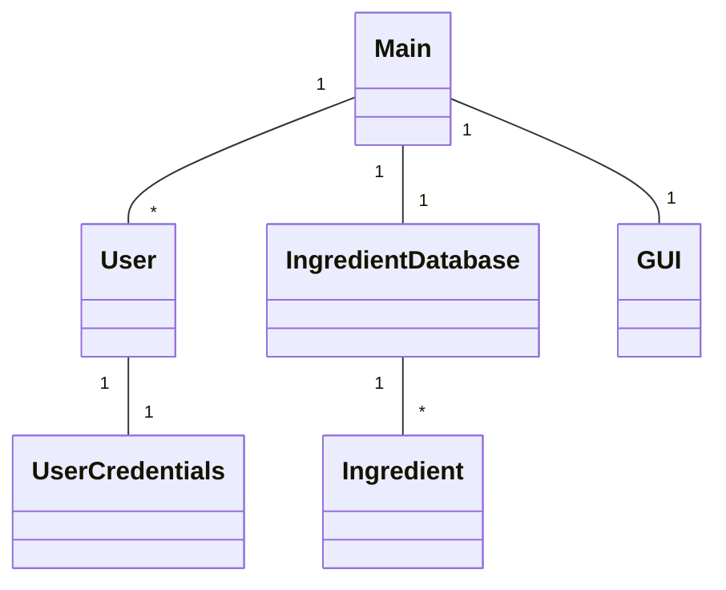
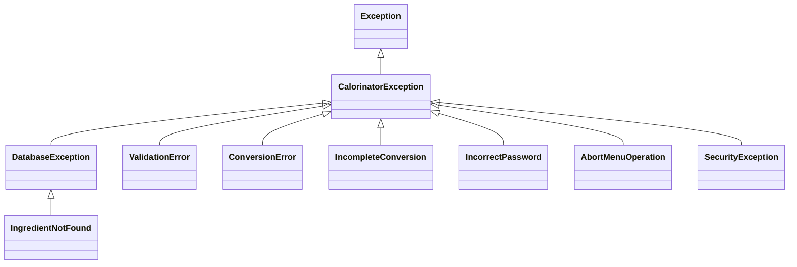
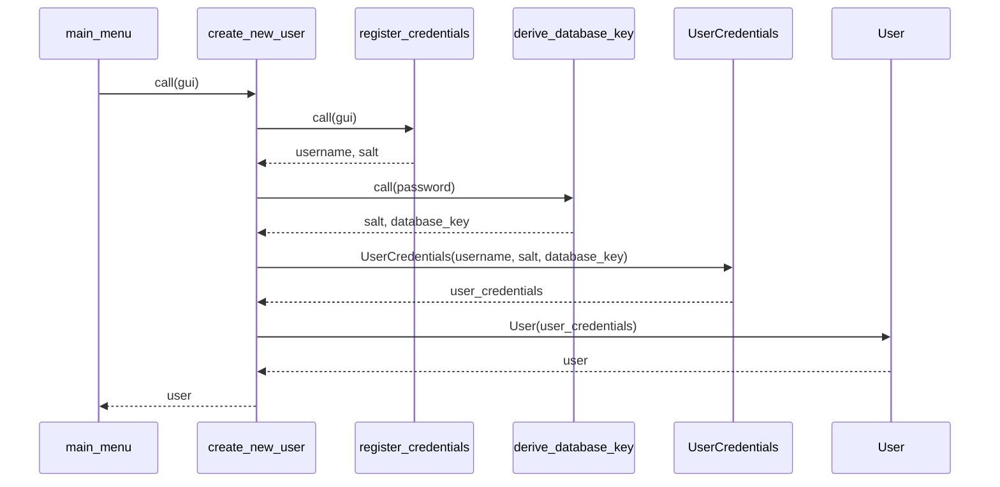

# Program class hierarchy

# Program exception hierarchy

# Sequence diagram of creating new user

Note that this is high-level description of the process. Library calls and details are omitted. 

