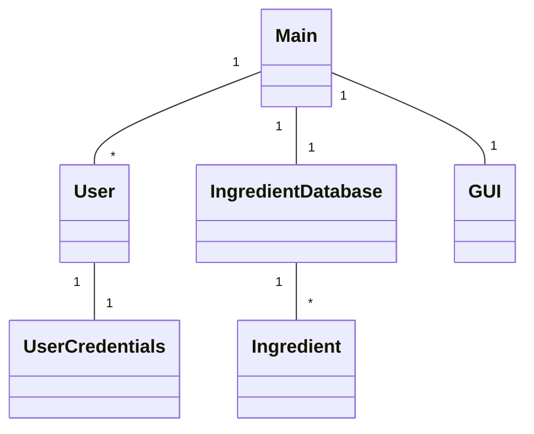
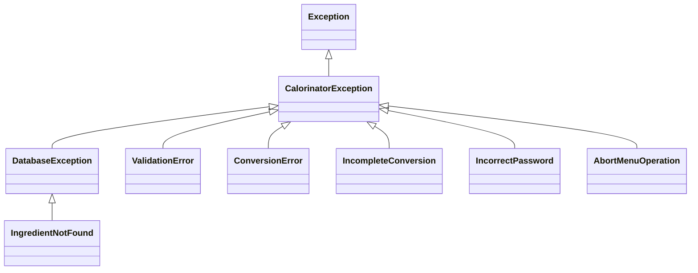

# Program class hierarchy

```mermaid
classDiagram
    
    IngredientDatabase "1" -- "*" Ingredient
    Main               "1" -- "*" User
    Main               "1" -- "1" GUI
    Main               "1" -- "1" IngredientDatabase
    User               "1" -- "1" UserCredentials
```

# Program exception hierarchy

```mermaid
classDiagram
    
    Exception            <|-- CalorinatorException
    CalorinatorException <|-- DatabaseException 
    DatabaseException    <|-- IngredientNotFound
    CalorinatorException <|-- ValidationError 
    CalorinatorException <|-- ConversionError 
    CalorinatorException <|-- IncompleteConversion 
    CalorinatorException <|-- IncorrectPassword 
    CalorinatorException <|-- AbortMenuOperation 
```
