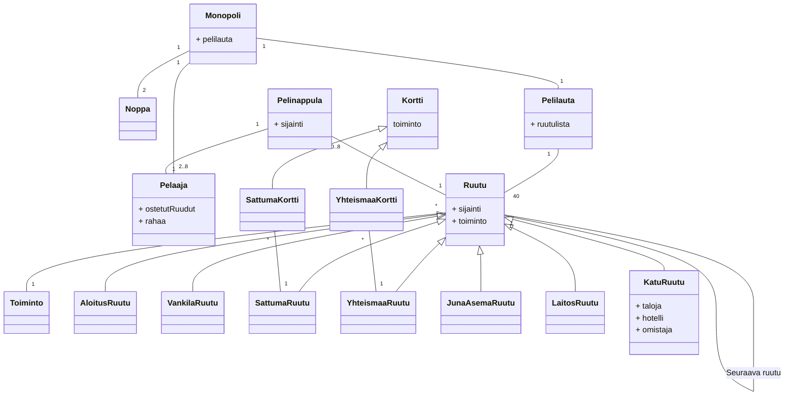

```mermaid
classDiagram
    Monopoli    "1" --  "2"    Noppa
    Monopoli    "1" --  "2..8" Pelaaja
    Monopoli    "1" --  "1"    Pelilauta

    Pelilauta   "1" -- "40"    Ruutu

    Pelinappula "1"    --  "1" Pelaaja
    Pelinappula "0..8" --  "1" Ruutu

    Ruutu       "1" --  "1"    Ruutu : Seuraava ruutu
    Ruutu       "*" --  "1"    Toiminto

    Ruutu <|-- AloitusRuutu
    Ruutu <|-- VankilaRuutu
    Ruutu <|-- SattumaRuutu
    Ruutu <|-- YhteismaaRuutu
    Ruutu <|-- JunaAsemaRuutu
    Ruutu <|-- LaitosRuutu
    Ruutu <|-- KatuRuutu

    class Monopoli {
        + pelilauta
    }
    class Pelilauta {
        + ruutulista
    }

    class Ruutu {
        + sijainti
        + toiminto
    }

    class Kortti {
        toiminto
    }

    Kortti <|-- YhteismaaKortti
    Kortti <|-- SattumaKortti

    YhteismaaKortti "*" -- "1" YhteismaaRuutu
    SattumaKortti   "*" -- "1" SattumaRuutu


    class KatuRuutu {
        + taloja
        + hotelli
        + omistaja
    }

    class Pelaaja {
        + ostetutRuudut
        + rahaa
    }

    class Pelinappula {
        + sijainti
    }
```