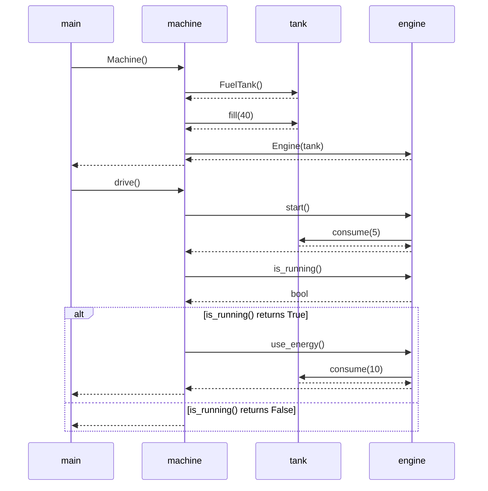

```mermaid

sequenceDiagram
    main->>machine: Machine()

    machine->>tank: FuelTank()
    tank-->>machine: 

    machine->>tank: fill(40)
    tank-->>machine: 

    machine->> engine: Engine(tank)
    engine-->>machine: 
    machine-->>main: 
    
    %% ----
 
    main->>machine: drive()
        machine->>engine: start()
            engine->>tank: consume(5)
            tank-->>engine: 
        engine-->>machine: 

    machine->>engine: is_running()
    engine-->>machine: bool
    
    alt is_running() returns True
        machine->>engine: use_energy()
        engine->>tank: consume(10)
        tank-->>engine: 
        engine-->>machine: 
        machine-->>main: 
    else is_running() returns False
        machine-->>main: 
    end
```
