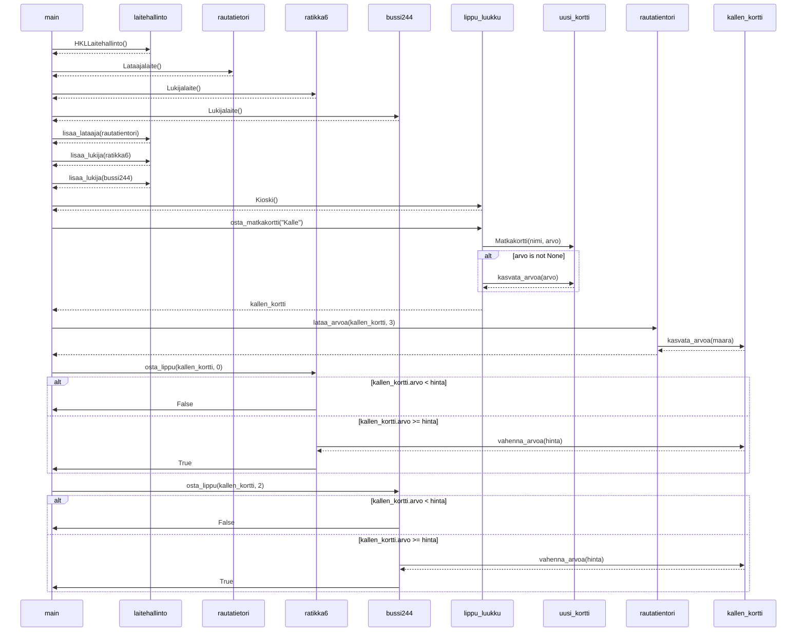

```mermaid

sequenceDiagram
    main->>laitehallinto: HKLLaitehallinto()
    laitehallinto-->>main: 

    main->>rautatietori: Lataajalaite()
    rautatietori-->>main: 
    main->>ratikka6: Lukijalaite()
    ratikka6-->>main: 
    main->>bussi244: Lukijalaite()
    bussi244-->>main: 

    %%

    main->>laitehallinto: lisaa_lataaja(rautatientori)
    laitehallinto-->>main: 
    main->>laitehallinto: lisaa_lukija(ratikka6)
    laitehallinto-->>main: 
    main->>laitehallinto: lisaa_lukija(bussi244)
    laitehallinto-->>main: 

    %%

    main->>lippu_luukku: Kioski()
    lippu_luukku-->>main: 

    main->>lippu_luukku: osta_matkakortti("Kalle")
        lippu_luukku->>uusi_kortti: Matkakortti(nimi, arvo)
        alt arvo is not None
            lippu_luukku->>uusi_kortti: kasvata_arvoa(arvo)
            uusi_kortti-->>lippu_luukku: 
        end
    lippu_luukku-->>main: kallen_kortti

    %%
    
    main->>rautatientori: lataa_arvoa(kallen_kortti, 3)
    rautatientori->>kallen_kortti: kasvata_arvoa(maara)
    kallen_kortti-->>rautatientori: 
    rautatientori-->>main: 


    %%
    
    main->>ratikka6: osta_lippu(kallen_kortti, 0)

    alt kallen_kortti.arvo < hinta
        ratikka6->>main: False
    else kallen_kortti.arvo >= hinta
        ratikka6->>kallen_kortti: vahenna_arvoa(hinta)
        kallen_kortti-->>ratikka6: 
        ratikka6->>main: True
    end

    %%
    
    main->>bussi244: osta_lippu(kallen_kortti, 2)

    alt kallen_kortti.arvo < hinta
        bussi244->>main: False
    else kallen_kortti.arvo >= hinta
        bussi244->>kallen_kortti: vahenna_arvoa(hinta)
        kallen_kortti-->>bussi244: 
        bussi244->>main: True
    end

```
